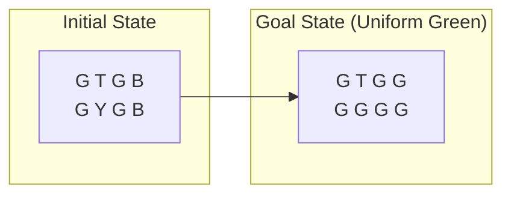

> *This project was developed for the **Introduction to Artificial Intelligence** course (A.Y. 2025/2026) at the University of Perugia.*

**Uniform Coloring** is a problem domain consisting of a rectangular grid of cells. Each cell has an initial color, and an agent (represented by a "coloring head" **T**) moves through the grid to achieve a specific goal.

The objective is to color all the cells in the grid with the same color (any of the available ones) and return the coloring head to its starting position with the minimum possible cost.

### Domain Rules & Constraints
- **Movement:** The head can move in the four cardinal directions (North, South, East, West) to adjacent cells. It cannot move outside the grid boundaries.
- **Coloring:** The head can change the color of the cell it currently occupies to any available color.
- **Colors & Costs:** - **Blue (B):** Cost 1
    - **Yellow (Y):** Cost 2
    - **Green (G):** Cost 3
    - **Movement:** Every step has a uniform cost of 1.
- **Goal State:** All cells must be the same color, and the head must return to its initial coordinates.

## Features
The system takes an image of the grid as input. Using **OpenCV** and classification models (such as those trained on **MNIST/eMNIST**), the application:
- Identifies the grid structure.
- Detects the initial position of the agent (**T**).
- Recognizes the initial color of each cell.

The problem is modeled as a **state-space search** problem by extending the `Problem` class from the **AIMA-python** library. 
- **Algorithms:** Implements both uninformed (e.g., BFS, DFS) and informed search (e.g., A*).
- **Heuristics:** Includes custom admissible and consistent heuristics to optimize the search for the goal state.

### Simulation
Once a solution (a sequence of actions) is found, the system generates a visual simulation showing the agent moving and coloring the cells until the uniform goal is reached.

## Example

**Possible Solution:** `Sud, col-G, East, East, col-G, Nord, col-G, West, West` 
- **Cost:** 15 
- **Length:** 9 actions.
